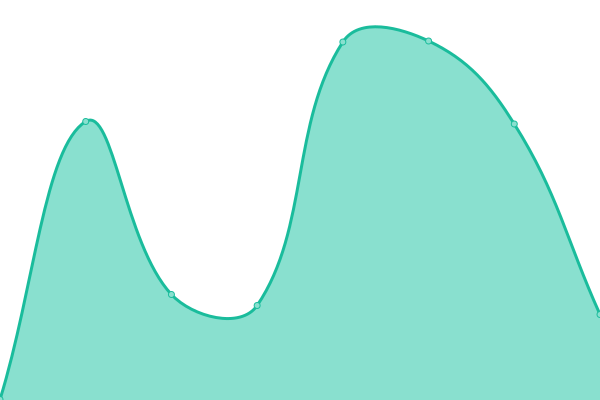
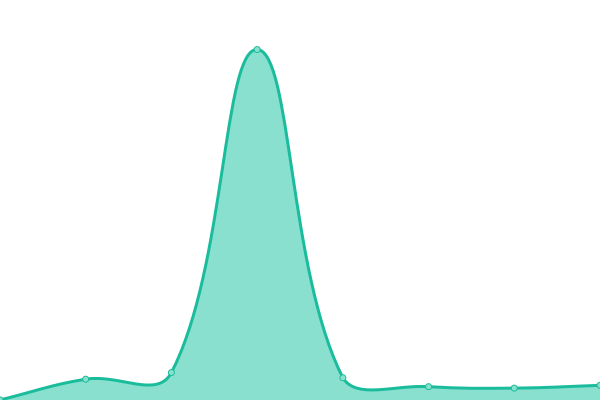
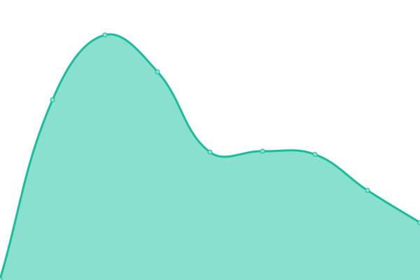

# [📈 Live Status](https://status.ausmlab.xyz): <!--live status--> **🟩 All systems operational**

This repository contains the open-source uptime monitor and status page for [zappper](https://status.ausmlab.xyz), powered by [Upptime](https://github.com/upptime/upptime).

With [Upptime](https://upptime.js.org), you can get your own unlimited and free uptime monitor and status page, powered entirely by a GitHub repository. We use [Issues](https://github.com/zappper/status/issues) as incident reports, [Actions](https://github.com/zappper/status/actions) as uptime monitors, and [Pages](https://status.ausmlab.xyz) for the status page.

<!--start: status pages-->
<!-- This summary is generated by Upptime (https://github.com/upptime/upptime) -->
<!-- Do not edit this manually, your changes will be overwritten -->
<!-- prettier-ignore -->
| URL | Status | History | Response Time | Uptime |
| --- | ------ | ------- | ------------- | ------ |
|  [QDrone Benchmark](https://benchmark.qdrone.ausmlab.com) | 🟩 Up | [q-drone-benchmark.yml](https://github.com/zappper/status/commits/HEAD/history/q-drone-benchmark.yml) | 

 358ms
     
 | 

<a href="https://status.ausmlab.xyz/history/q-drone-benchmark">100.00%</a>
    

|  [Downloads Server](https://downloads.ausmlab.com) | 🟩 Up | [downloads-server.yml](https://github.com/zappper/status/commits/HEAD/history/downloads-server.yml) | 

 167ms
     
 | 

<a href="https://status.ausmlab.xyz/history/downloads-server">100.00%</a>
    

|  [YUGeomatics](https://yugeomatics.ca) | 🟩 Up | [yu-geomatics.yml](https://github.com/zappper/status/commits/HEAD/history/yu-geomatics.yml) | 

 2847ms
     
 | 

<a href="https://status.ausmlab.xyz/history/yu-geomatics">99.82%</a>
    

|  GPU Server | 🟩 Up | [gpu-server.yml](https://github.com/zappper/status/commits/HEAD/history/gpu-server.yml) | 

 249ms
     
 | 

<a href="https://status.ausmlab.xyz/history/gpu-server">100.00%</a>
    

|  [Wiki](https://wiki.gpu.ausmlab.xyz) | 🟩 Up | [wiki.yml](https://github.com/zappper/status/commits/HEAD/history/wiki.yml) | 

 391ms
     
 | 

<a href="https://status.ausmlab.xyz/history/wiki">100.00%</a>
    

|  NAS Server 1 | 🟩 Up | [nas-server-1.yml](https://github.com/zappper/status/commits/HEAD/history/nas-server-1.yml) | 

 277ms
     
 | 

<a href="https://status.ausmlab.xyz/history/nas-server-1">100.00%</a>
    

|  NAS Server 2 | 🟩 Up | [nas-server-2.yml](https://github.com/zappper/status/commits/HEAD/history/nas-server-2.yml) | 

 261ms
     
 | 

<a href="https://status.ausmlab.xyz/history/nas-server-2">100.00%</a>
    

<!--end: status pages-->

[**Visit our status website →**](https://status.ausmlab.xyz)

## 📄 License

- Powered by: [Upptime](https://github.com/upptime/upptime)
- Code: [MIT](./LICENSE) © [zappper](https://status.ausmlab.xyz)
- Data in the `./history` directory: [Open Database License](https://opendatacommons.org/licenses/odbl/1-0/)
